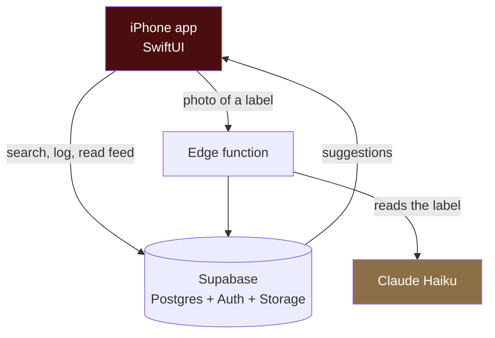
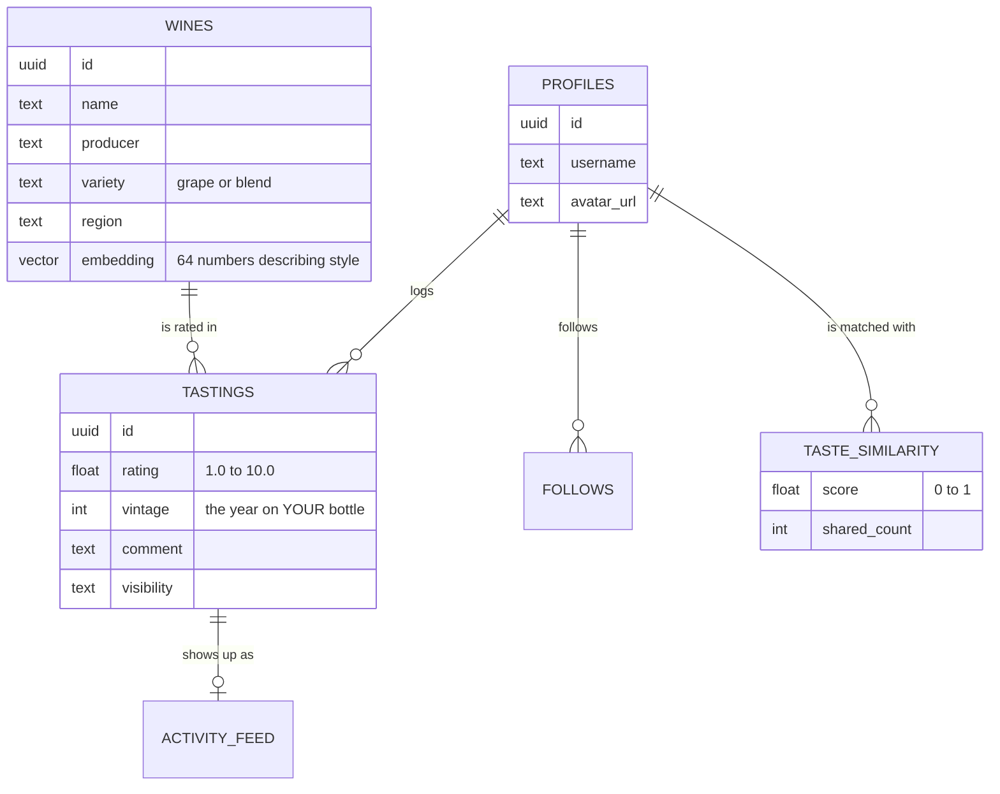

# Pari

An iOS app for people who drink wine and want to remember what they liked.

You log a wine, give it a score out of 10, and add a note if you feel like it. Over time Pari learns your palate, finds other users whose ratings line up with yours, and uses them to suggest bottles you have not tried.

---

## What you can do in the app

**Log a wine.** Search the catalog (about 100,000 wines) or point your camera at a label and let the app read it.

**Score it.** One slider, 1.0 to 10.0. Notes and a photo are optional. You choose whether the post is public or friends only.

**See what others are drinking.** A feed of recent tastings you can react to and comment on.

**Get suggestions.** A "For You" list of wines picked from your own ratings and from people who rate like you.

**Track your palate.** Your profile shows which grapes and regions you gravitate toward, and who your closest taste matches are.

---

## How it fits together



There is no server of our own to run. The app talks straight to Supabase, which handles the database, sign in, and file storage. The one exception is label scanning: that goes through a small edge function so the Anthropic API key stays on the server and never ships inside the app.

---

## The data

Five tables carry most of the app.



One thing worth calling out: a row in `wines` is a *wine*, not a bottle. "Opus One" is one row, covering every year it has ever been made. The year lives on your tasting, because the 2019 you drank and the 2021 your friend drank are the same wine but different bottles.

---

## How the suggestions actually work

This is the part that makes Pari different from a notebook.

**Step 1. Every wine gets a fingerprint.** Sixty four numbers describing its style, worked out from its grapes and where it comes from. Wines that taste alike end up with similar fingerprints, so Cabernet Sauvignon and Cabernet Franc sit close together while Cabernet and Riesling sit far apart.

**Step 2. You get a fingerprint too.** It is the average of the wines you rated, weighted by how much you liked them. Score something a 9 and it pulls your fingerprint toward it. Score it a 3 and it pushes away.

**Step 3. Find your taste twins.** Two signals get blended. If you and another user have rated a lot of the same wines, we compare those scores directly. If you have barely overlapped, we compare fingerprints instead. New users get useful matches on day one rather than waiting to build history.

**Step 4. Suggest.** Pull the wines closest to your fingerprint, then reorder them by what your twins scored. A wine with one enthusiastic rating does not outrank a wine with forty solid ones.

---

## Getting it running

You need a Mac with Xcode 16 or newer, and a free Supabase account.

**1. Open the project**

```bash
open Pari.xcodeproj
```

Xcode pulls the Swift packages on its own. If it does not, use File then Packages then Resolve Package Versions.

**2. Point it at your Supabase project**

```bash
cp Pari/Core/SupabaseConfig.example.swift Pari/Core/SupabaseConfig.swift
```

Open that file and paste in your project URL and anon key, both from the Supabase dashboard under Settings then API. The file is gitignored, so your keys stay on your machine.

**3. Build the database**

In the Supabase dashboard, open the SQL Editor and run `supabase/setup_schema.sql`. That creates every table, view, function, and access rule in one go.

If you already have a database from an earlier version, run the files in `supabase/migrations/` in filename order instead. Order matters, since later ones build on earlier ones.

**4. Turn on label scanning (optional)**

```bash
supabase functions deploy claude-vision
supabase secrets set CLAUDE_API_KEY=sk-ant-...
```

Skip this and everything else still works. You just add wines by searching instead of scanning.

**5. Run it**

Pick a simulator in Xcode and press Cmd+R.

---

## Where things live

```
Pari/
  Models/       plain data: Wine, Tasting, Profile
  Services/     everything that talks to Supabase or Claude
  Features/     one folder per screen, each with its view and view model
  Themes/       colors, fonts, spacing
  Core/         config and app wide constants

PariTests/      unit tests
supabase/
  setup_schema.sql   the whole database in one file
  migrations/        incremental changes, run in filename order
  functions/         the label scanning edge function
scripts/
  import_xwines.py   turns the X-Wines dataset into a CSV you can upload
```

Screens follow the same shape throughout. A view draws things, a view model holds the state, a service does the talking. If you are adding a screen, copy the pattern from `Features/Cellar`.

---

## Tests

```bash
xcodebuild test -project Pari.xcodeproj -scheme Pari -destination 'platform=iOS Simulator,name=iPhone 17'
```

---

## Built with

SwiftUI on iOS 17 and up. Supabase for database, auth, and storage, with pgvector for the taste matching. Claude Haiku for reading labels. Wine catalog from the [X-Wines dataset](https://github.com/rogerioxavier/X-Wines), public domain.

---

## If something breaks

**Cannot connect.** Check that `SupabaseConfig.swift` exists and the values match your dashboard.

**"row violates row level security".** The schema did not finish running. Run `setup_schema.sql` again, it is safe to repeat.

**Feed is empty.** Nothing has been logged yet, or the account you are viewing follows nobody. Log a wine and it will show up.

**Scanning returns an error.** The edge function is not deployed, or `CLAUDE_API_KEY` is not set. Scans are also capped at 30 per hour per account.

**Build fails after pulling.** Clean the build folder with Cmd+Shift+K, then File then Packages then Reset Package Caches.
