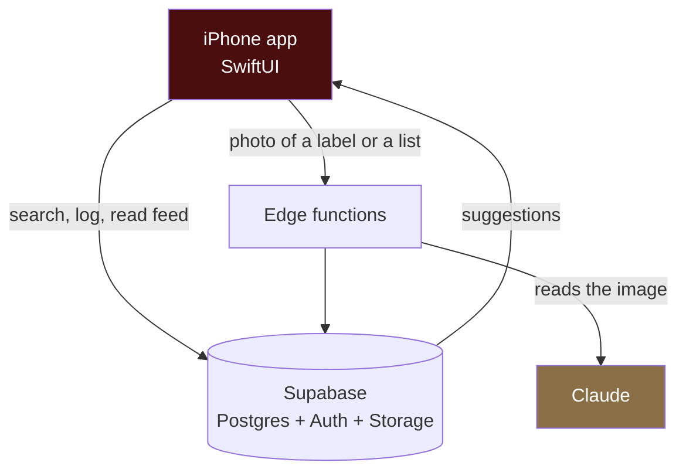
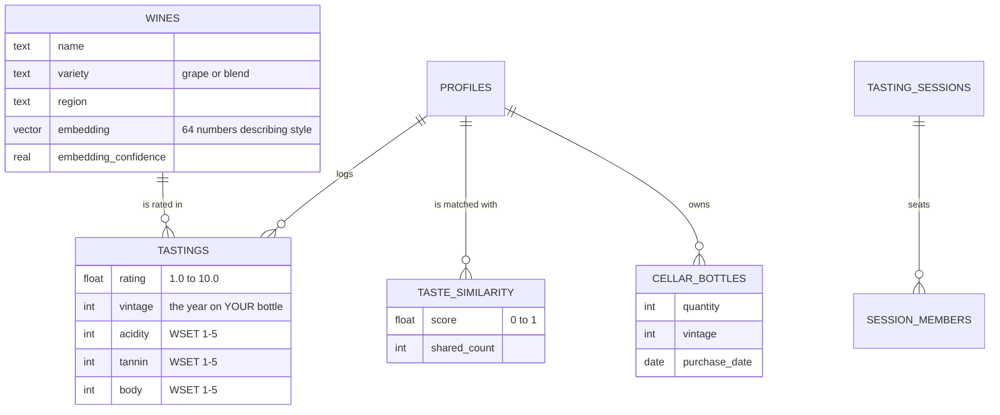

# Pari

An iOS app for people who drink wine and want to remember what they liked.

You log a wine, give it a score out of ten, and add a note if you feel like it. Over time Pari learns your palate, finds the other users whose ratings line up with yours, and uses them to suggest bottles you have not tried.

> **Source-available, not open source.** This repository is published so the work can be read. It is not set up to be cloned and run, there are no setup instructions, and no licence to use the code is granted. See [LICENSE](LICENSE).

---

## What it does

**Log a wine.** Search a catalogue of about 100,000, or point the camera at a label and let the app read it.

**Score it.** One slider, 1.0 to 10.0. A structural grid (acidity, tannin, body) is there for people who want it and hidden from people who do not.

**Scan a wine list.** Photograph a restaurant list and get every wine on it ranked for your palate, with the ones we cannot identify shown as unidentified rather than guessed.

**Sit at a table.** Start a shared session, read a five-character code out, and get the bottle that suits everyone sitting there.

**Keep a cellar.** Bottles you own, with estimated drinking windows and a view of what to open tonight before it closes.

---

## How it fits together

There is no server of our own. The app talks to Supabase, which handles the database, sign in and file storage. The exception is image reading, which goes through small edge functions so the API key stays server-side and never ships inside the app.

---

## The interesting part

Most of the work was not adding features. It was finding out that things which looked like they worked did not.

### Vintage was on the wrong table

A row in `wines` is a *wine*, not a bottle. "Opus One" is one row covering every year it has ever been made. But vintage was stored on that row, and the label scanner wrote to it. So the first person to scan a 2019 stamped that year onto the shared catalogue entry, and everyone who logged that wine afterwards recorded a vintage they had never drunk.

The fix was to move vintage onto the tasting, where it belongs, and stop the scanner writing to the catalogue at all.

### The taste model had never run

Wine similarity is computed from a 64-dimension vector per user, built from the wines they rated. The function that builds it cast a `vector` to `double precision[]`, which pgvector does not support. It raised on the first row it touched.

Every caller in the app caught the error and returned nothing, so it surfaced as "no taste twins yet" rather than as a failure. The content-based half of the recommendation engine had been dead the whole time and looked like a product that had not warmed up yet.

That one only turned up when the migrations were run against a real Postgres for the first time.

### The embedding did not mean anything

Wine vectors were built by hashing the grape and region strings. Deterministic, cheap, and carrying no meaning at all: Cabernet Sauvignon and Cabernet Franc hashed to unrelated bit patterns.

| | old | new |
|---|---:|---:|
| Cabernet Sauvignon ↔ Cabernet Franc | −0.15 | 0.99 |
| Bordeaux blend ↔ its lead grape | 0.37 | 1.00 |
| Cabernet Sauvignon ↔ Riesling | 0.25 | 0.21 |

The old numbers were not just low, they were in the wrong order. An unrelated pair scored *higher* than two grapes from the same family. Rebuilt from a varietal and region taxonomy, with hashing kept only as a fallback for terms it does not recognise.

### One bottle, several palates

Four people at a table is a social choice problem, and it has more than one honest answer. Ranking by the average can pick a wine one person dislikes. Ranking by the worst-served person picks the bottle nobody objects to and nobody wants.

Pari ranks by the average but excludes any wine where someone falls below a floor. The failure that matters at a table is one person stuck with a glass they hate, so that one is made impossible rather than merely unlikely.

### Why it does not just show a rating out of five

A global average has one target, and producers can aim at it. Wine has already run that experiment: under the 100-point regime, styles narrowed toward whatever scored well. A network of personal predictions has no single target to aim at.

So the number Pari shows is "8.7 for you", not "8.7 out of 10", and it names the people it came from.

---

## The data

The structural columns follow the WSET Systematic Approach to Tasting rather than a private vocabulary, because that scale is already taught in over 70 countries and anyone learning it here is learning something portable.

Those six numbers also do more work than the score does. The grape taxonomy gives each wine a starting guess at its structure; real tastings then move it, weighted so that the crowd overtakes the guess at around five observations. The catalogue gets more accurate every time somebody drinks something.

---

## Built with

SwiftUI on iOS 17 and up. Supabase for database, auth and storage, with pgvector for the taste matching and HNSW for retrieval. Claude for reading labels and wine lists. Catalogue from the [X-Wines dataset](https://github.com/rogerioxavier/X-Wines), public domain.

Recommendations are measured, not assumed: there is an evaluation harness reporting NDCG, catalogue coverage and a concentration metric, because a recommender that scores well by showing everyone the same forty bottles has moved the problem rather than solved it.

---

## Status

In development, not released. Screenshots and a TestFlight link will go here when there is something worth showing.

Questions about the work are welcome at aderici@unc.edu. Requests to use the code are covered by [LICENSE](LICENSE).
